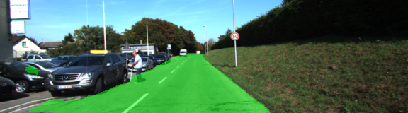
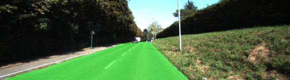
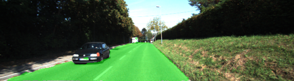
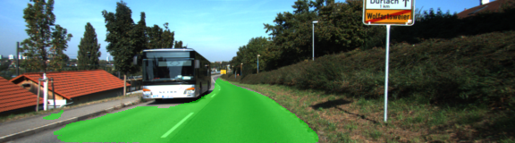
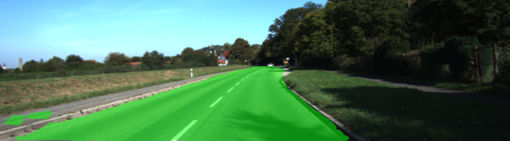
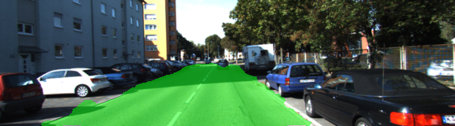
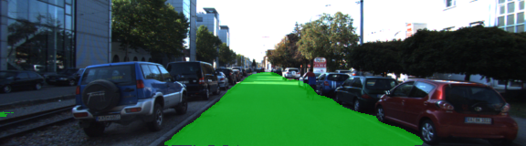
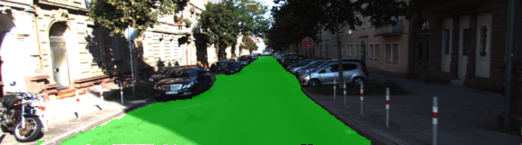

# Udacity Semantic Segmentation Project (Advanced Deep Learning)

## Introduction
The goal of the project is to label the pixels of a road in images using a Fully Convolutional Network (FCN).

The goal of this project is to construct a fully convolutional neural network based on the VGG-16 image classifier architecture for performing semantic segmentation to identify drivable road area from an car dashcam image (trained and tested on the KITTI data set).

## Approach

### Architecture

A pre-trained VGG-16 network was converted to a fully convolutional network by converting the final fully connected layer to a 1x1 convolution and setting the depth equal to the number of desired classes: "road" and "not-road". Performance is improved through the use of skip connections, performing 1x1 convolutions on previous VGG layers (in this case, layers 3 and 4) and adding them element-wise to upsampled (through transposed convolution) lower-level layers (i.e. the 1x1-convolved layer 7 is upsampled before being added to the 1x1-convolved layer 4). Each convolution and transpose convolution layer includes a kernel initializer and regularizer

### Optimizer

The loss function for the network is cross-entropy, and an Adam optimizer is used.

### Training

The hyperparameters used for training are:

  - keep_prob: 0.5
  - learning_rate: 0.0009
  - epochs: 50
  - batch_size: 1

## Results

Loss per batch tends to average below 0.200 after two epochs and below 0.100 after ten epochs. Average loss per batch at epoch 20: 0.048, at epoch 30: 0.062, at epoch 40: 0.031, and at epoch 50: 0.027. In conclusion, performance is quite good, with only spots of road identified in some of the images .

### Samples

Below are a few sample images from the output of the fully convolutional network, with the segmentation class overlaid upon the original image in green.

